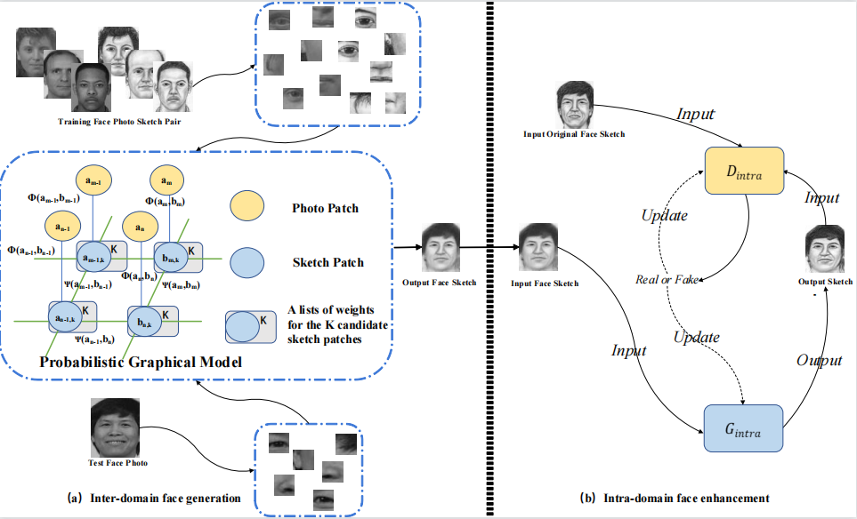
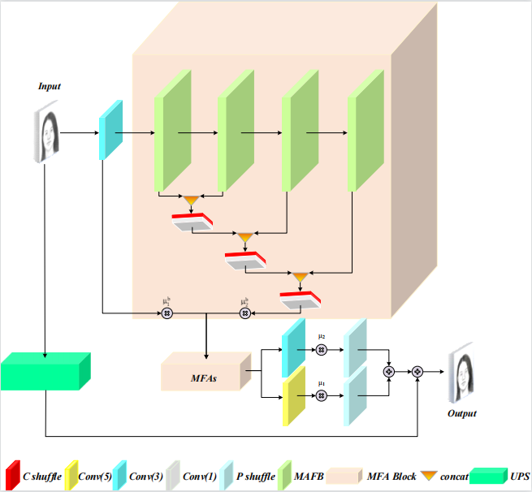
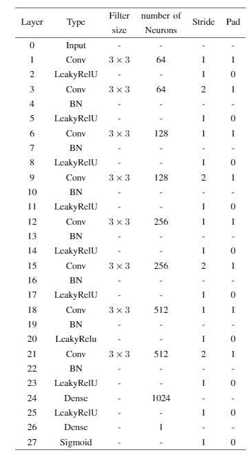
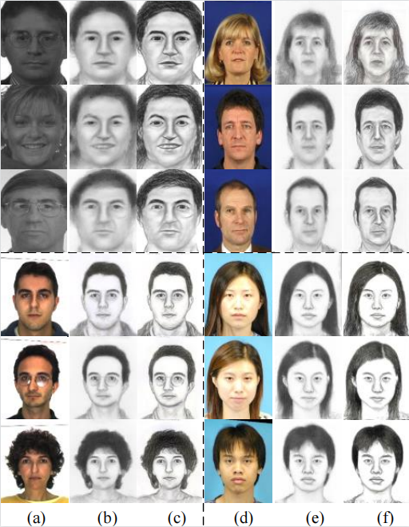
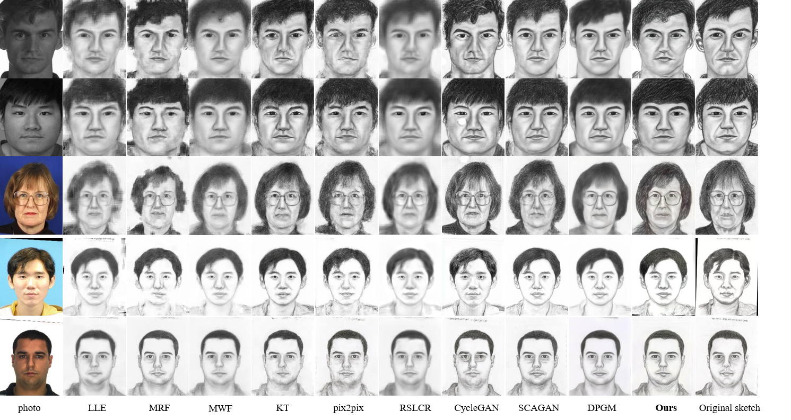
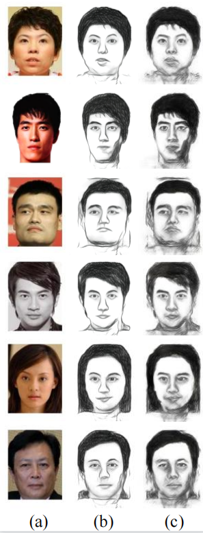
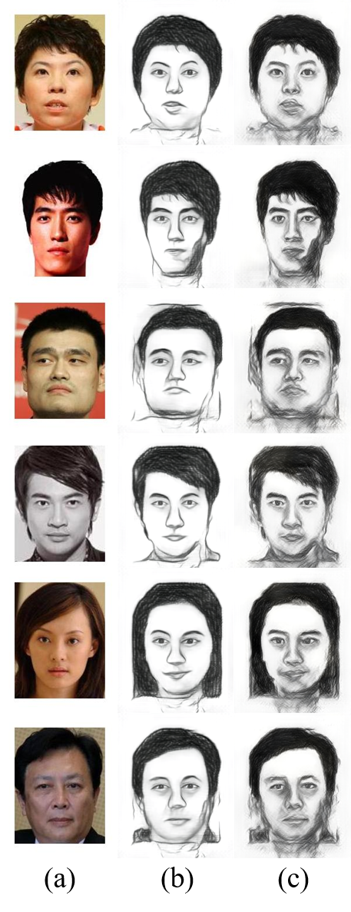

## Face Photo-Sketch Synthesis via Intra-Domain Enhancement

torch Implementation of ["Face Photo-Sketch Synthesis via Intra-Domain Enhancement"](https://github.com/shenhaiyoualn/idesketch)

### The framework of our proposed Intra-Domain  Enhancement (IDE) method

	

</a>

### The architecture of the Generator Network

	

</a>

### The architecture of the Discriminator Network

	

</a>

## Results
### Example synthesis face sketches results. 

	

</a>
(a) Input photos. (b) Results after inter-domain generation. (c) Result after intra-domain enhancement.

### Comparison on public face sketch dataset. The result of the first two columns are on the CUFSF dataset, and the following three datasets are in turn the comparison of XM2VTS,CUHK and AR dataset in different face sketch synthesis methods.

	

</a>

### Example pairs of input forensic images on a variety of real-world forensic photos for face sketch synthesis using our proposed IDE-based method. 

	

</a>

### Comparison of celebrity photos retrieved from the Internet. (a) Input photos. (b) Results based on CUFSF. (c) Results based on CUFS.

	

</a>
More synthesis results are available ["Online"] (http://chunleipeng.com/MrFSPS/MrFSPS_Sketch.html)
