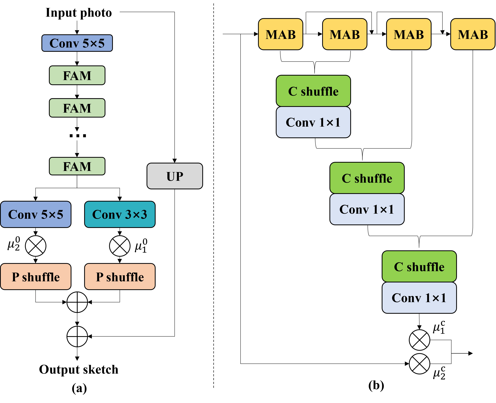

## Face Photo-Sketch Synthesis via Intra-Domain Enhancement

We provide `PyTorch` implementations for our KBS2022 paper [`Face Photo-Sketch Synthesis via Intra-Domain Enhancement`](https://ieeexplore.ieee.org/abstract/document/9845477): 

## Abstract

Face photo-sketch synthesis plays an increasingly important role in the field of law enforcement and entertainment. However, most of the existing methods only focus on how to cross the modality differences between the photo domain and the sketch domain, while neglecting the image quality enhancement of the generated faces. In this paper, we propose a novel intra-domain enhancement (IDE) method for the face photo-sketch synthesis task. Our method is composed of two steps to cope with the inter-domain generation gap and the intra-domain quality defect respectively, i.e. inter-domain face generation and intra-domain face enhancement. In the inter-domain face generation stage, we apply a probabilistic graphical model which is capable of synthesizing the coarse face sketch from photos with low quality. In the intra-domain face enhancement stage, a multi-Layer feature Aggregation (MLA) based Generative Adversarial Networks (GAN) is designed to enhance the facial details in the sketches and further refine the synthesized image quality. Our first phase helps bridge the modality gap between photo and sketch and ensures the shape consistency between them, and the second phase aims to improve the detail quality and resolution of the synthesized sketches. Extensive experimental results on public face sketch databases illustrate the effectiveness of our proposed approach.

### More synthesis results are available [Online](https://github.com/shenhaiyoualn/idesketch/tree/main/imgs/fine-sketch)

### The framework of our proposed Intra-Domain  Enhancement (IDE) method

	

</a>

### The architecture of the Generator Network

	
	

</a>

### Acknowledgments
Our code is inspired by [mmediting](https://github.com/open-mmlab/mmediting)

